# 🌌 Aether Credit: Autonomous Multi-Agent Underwriting System

<div align="center">
  
  
  
</div>

<br/>

**Aether Credit** is an enterprise-grade, deterministic Artificial Intelligence system engineered to fully automate corporate credit risk assessment. By utilizing a decentralized swarm of highly specialized AI agents, Aether accomplishes what typically takes human auditors days, **in under 8 seconds**, with mathematically verifiable accuracy.

---

## ⚙️ Advanced System Architecture

The core philosophy of Aether is **"Deterministic Hybrid Intelligence"**. We bypass the hallucination risks of standard LLMs by using them strictly as cognitive data parsers, while the actual risk formulation happens inside a hardcoded algorithmic engine.

### 🧠 The Multi-Agent Swarm (MAS) Topology

```mermaid
graph TD
    classDef io fill:#0f172a,stroke:#3b82f6,stroke-width:2px;
    classDef agent fill:#064e3b,stroke:#10b981,stroke-width:2px;
    classDef db fill:#4c1d95,stroke:#8b5cf6,stroke-width:2px;

    Client[Client Dashboard]:::io -- FormData POST --> Ing[Ingestion Gateway]:::io
    Ing -- Binary Stream --> PA[Parsing Swarm Agent]:::agent
    
    subgraph Cognitive Layer
    PA -- Extracts JSON --> CA[Coordinator Neural Node]:::agent
    CA -- Triggers --> FA[Financial Analysis Agent]:::agent
    CA -- Triggers --> LA[Legal Insight Agent]:::agent
    CA -- Triggers --> BA[Behavioral Risk Agent]:::agent
    end
    
    subgraph Deterministic Engine
    FA -- Ratios & KPIs --> RE[Math Risk Engine]:::db
    LA -- Litigations --> RE
    BA -- Fraud Flags --> RE
    end
    
    RE -- Base Score: 0-1000 --> XAI[Explainable AI Synthesis Agent]:::agent
    XAI -- Generates Markdown --> DB[(Prisma PostreSQL)]:::db
    DB -- Server-Sent Events --> Client
```



---

## 🔄 Cognitive Execution Workflow

The pipeline is event-driven and strictly asynchronous to ensure zero blocking during heavy document processing.

### Phase 1: Zero-Shot Data Extraction (The Parser)
*   **Input**: Unstructured external data (Bank Statements, Balance Sheets, MCA filings).
*   **Execution**: The file is passed to `Gemini 1.5 Flash` with a strict `application/json` output schema. 
*   **Validation**: Edge-level middleware validates that all required financial metrics (Revenue, Debt, Margins) are successfully extracted.

### Phase 2: Parallel Analysis (The Swarm)
Rather than a single prompt bottleneck, the Coordinator triggers independent micro-agents:
*   **Agent Alpha (Financial)**: Calculates *Debt-to-Equity, DSCR, and Altman Z-score*.
*   **Agent Beta (Forensic)**: Scans continuous streams for anomalies (repeated uniform deposits, high-frequency low-value transactions).
*   **Agent Gamma (Legal)**: Checks registry structures (CIN/PAN) against known compliance databases.

### Phase 3: The Deterministic Risk Engine
The qualitative data from the swarm is fed into a mathematical underwriting algorithm. It adjusts a base score (e.g., 500) through weighted heuristic multipliers based on risk parameters, generating a final normalized score scaled from `0` to `1000` (`< 400`: High Risk, `> 700`: Low Risk).

### Phase 4: XAI Reporting & Synthesis
The raw math score is sent to the *Synthesis Agent* which generates a Markdown-based **Credit Dossier**. This ensures maximum explainability—auditors don't just see a "Rejected" label; they see exact reasons (e.g., *Debt ratio skewed by 18% month-over-month*).

---

## 🛠 Enterprise Tech Stack

Aether is engineered for scalability, low latency, and maximum security.

| Layer | Technology | Purpose |
| :--- | :--- | :--- |
| **Frontend/UI** | `Next.js 15 (App Router)`, `React 19` | Server-Side Rendering (SSR) for blazing-fast dashboard load times. |
| **Aesthetics** | `Tailwind V4`, `Lucide`, `Vanilla CSS` | Deep space theme, GPU-accelerated micro-animations, Glassmorphism. |
| **Core AI Model** | `Google Gemini 1.5 Flash API` | High-speed cognitive processing with massive 1M token context windows. |
| **Database ORM** | `Prisma 6.1.0` | Type-safe database queries and automated schema migrations. |
| **Data Persistence**| `PostgreSQL (Neon / Render)` | Relational ACID-compliant storage for audit logs and entity data. |
| **API Architecture**| `Next.js Edge API Routes` | Serverless endpoints ensuring automated scaling on demand. |

---

## 🔥 What Makes it Unique?

*   **100% Explainability (XAI)**: We solve the "Black Box" AI problem. Every decision made by the network is backed by the deterministic engine and logged in the Audit Trail.
*   **Stateful "Always-On" Monitoring**: The system isn't just a static form; it includes a dynamic visualizer for active Agent Health, Memory Profiling, and Live API constraints.
*   **Decentralized AI Processing**: By decoupling tasks into specialized agents (Parser, Scorer, Synthesizer), we prevent token oversaturation and drastically improve output intelligence.

---

## 🚀 Getting Started (Local Development)

### 1. Prerequisites
- Node.js 18+ 
- PostgreSQL database
- Gemini API Key

### 2. Initialization
```bash
git clone https://github.com/kartikshete/hackerwarth.git
cd hackerwarth
npm install
```

### 3. Environment & Database Pipeline
```bash
cp .env.example .env
# Edit .env with your PostgreSQL DATABASE_URL and OPENAI/GEMINI API Keys

npx prisma generate
npx prisma db push --skip-generate
```

### 4. Ignite the Core
```bash
npm run dev
```
> The decentralized dashboard will now be active at `https://hackerwarth12.onrender.com`.

---

## 🏆 Credits & Acknowledgements

> *"Intelligence is not just data; it's the precision of decisions made in microseconds."*

**Aether Credit Intelligence** is the result of relentless optimization, late-night debugging, and an uncompromising vision to bring deterministic AI to the FinTech ecosystem. 

### 🧠 The Team
*   **Kartik Shete** – *Lead Architect & Full-Stack Developer* | Engineered the multi-agent swarm architecture, deterministic risk engine, and seamless Edge deployment.
*   **Team Aether** – *Research & Strategy* | Focused on data parsing compliance, heuristic math models, and underwriting logic.

*Built to redefine corporate credit logic. Designed for the real world.*
 