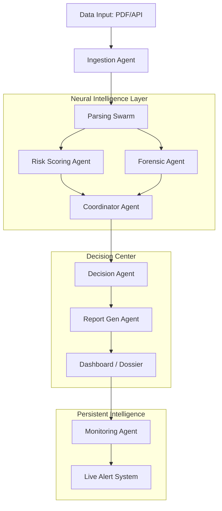

# Aether Credit: Agentic AI Architecture Blueprint

## 1. System Overview
Aether Credit is a decentralized-style corporate intelligence platform powered by a multi-agent swarm. It replaces manual underwriting with a fully autonomous analytical pipeline.

## 2. Multi-Agent Swarm (MAS) Architecture

## 3. Specialized Agents & Responsibilities

| Agent | Responsibility | Dynamic Tools |
| :--- | :--- | :--- |
| **Ingestion** | Multi-source collection | OCR, API Connectors, Scraping |
| **Parsing** | Structuring raw data | Gemini 1.5 Flash (JSON Output) |
| **Forensic** | Anomaly & Fraud Detection | Heuristic Engine + LLM Patterns |
| **Risk-Scoring**| Credit Health Benchmarking | Deterministic Math Model |
| **Decision** | Final Adjudication | Policy Engine + Underwriting Logic |
| **Reporting** | Synthesis & Visualization | Markdown-to-PDF, XAI Generation |
| **Monitoring** | 24/7 Behavioral Tracking | Cron Jobs, Real-time Webhooks |

## 4. Tech Stack (Next-Gen)
- **Backend Architecture**: Next.js 15 (Edge Functions) for ultra-low latency.
- **AI Core**: Google Gemini 1.5 Flash (for speed) & LangChain for orchestration.
- **Data Persistence**: Prisma + PostgreSQL (Relational) + Pinecone (Vector for historical context).
- **UI/UX**: Tailwind CSS + Framer Motion (Glassmorphism & Neon Aesthetics).

## 5. Execution Pipeline
1. **Phase 1: Ingestion & Structuring** (Files to JSON Mapping)
2. **Phase 2: Analytical Synchronization** (Parallel execution of Forensics & Scoring)
3. **Phase 3: Cognitive Decisioning** (AI-driven reasoning based on quantitative data)
4. **Phase 4: Synthesis & Monitoring** (Live report generation & alert hooks)

---
